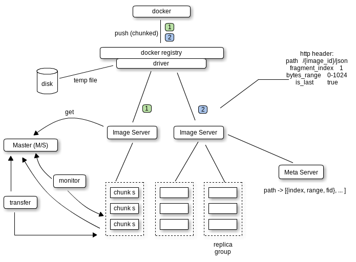

Introduction
============

Speedy is a high performance distributed docker image storage solution written by go/c. It can easily scale out by adding more storage instance and no data have to move around between storage instance.It is also production ready and used by [jcloud.com](http://jcloud.com).

Features
============
* High performance and efficient file storage engine written by c.
* High availability by multi copy of storage instance and stateless frond-end proxy image server.
* High controllability by introduce weak central master node. The upload/download process will not go through the master node.
* High scalability by dynamically adding more storage instance and frond-end proxy image server.
* Large file will be divided into small chunks and upload/download those chunks concurrently.
* Onboard storage monitoring system.
* Onboard rich operation tools.
* Docker registry 1.0 API are supported

Upcoming Features
============
* Online data transfer system.
* Docker registry 2.0 API support.
* General object storage system interface like S3/Swift.
* More operation tools.

Architecture
============

Component
============
* docker-registry-speedy-driver
Docker-registry backend storage driver for speedy, It divides docker image layer into fixed-size chunk concurrently upload/download to chunkserver.

* imageserver
It is a stateless frond-end proxy server designed to provide restful api to upload and download docker image. 
imageserver get chunkserver information and file id from chunkmaster periodically. 
imageserver choose a suitable chunkserver group to storage docker image according to chunkserver information independently, 
we can start many imageserver to provice service at the same time and docker-registry-speedy-driver can use anyone of them equally.

* chunkmaster
It is a central master node designed to maintain chunkserver information and allocate the file id. 
chunkmaster store chunkserver information to mysql and keep in memory as cache, while imageserver try to get chunkserver information chunkmaster send the information in memory to imageserver.
while imageserver try to get file id, chunkmaster allocate a continuous range of file id and send to imageserver.

* chunkserver
It is a highly optimized storage engine for performance and space efficiency.It appends single small image file into large files and maintain file index in memory keeping the IO overhead to a minimum. Normally, a chunkserver group is consist of 3 chunkservers, imageserver writes data to a chunkserver group suceess means storing data to each chunkserver of the group success. 

* metaserver
It is an another distributed key-value storage used by [jcloud.com](http://jcloud.com), since It's not open-source yet, you can use mysql instead which store the image layer metadata informations.

Quick Install
=============

+ docker-registry-speedy-driver   
cd docker-registry-speedy-driver   
python setup.py install   

+ imageserver/chunkmaster/chunktool      
cd src/github.com/speedycn    
./bootstrap.sh   
. ./dev.env   
make   

+ chunkserver   
cd chunkserver   
make   

+ metaserver   
we can use mysql instead.   

Startup sequence
================
1.chunkmaster   
2.chunkserver   
3.metaserver(mysql)
4.imageserver   
5.docker-registry   

After that you can push and pull docker images.

Performance Test
================

We made a performance test about upload and download of Speedy. We use 4 normal servers   
(CPU: 24 core 2G HZ; Memory: 16G; Disk: 300G 10k SAS; Ethernet: 1 Gigabit) to construct   
our test environment. 

                           imageserver [node1]
                        /          |           \
                       /           |            \
        chunk-server[node2] chunk-server[node3] chunk-server [node4]

We simply use mysql instead of our internal MetaServer, at the same time,    
chunkserver is on the default buffer io model.

+ Performance Results

<table>
<tr><td> concurrent &nbsp;</td><td> fileSize(M)&nbsp; </td><td> file count&nbsp; </td><td> upload time(seconds)&nbsp; </td><td> download time(seconds)&nbsp; </td><td> upload speed(M/s)&nbsp; </td><td> download speed(M/s)&nbsp; </td></tr>
<tr><td> 10         </td><td> 16          </td><td> 100        </td><td> 42.85                </td><td> 15.23                  </td><td> 37.34        </td><td> 105.06 </td></tr>
<tr><td> 50         </td><td> 16          </td><td> 100        </td><td> 42.82                </td><td> 16.29                  </td><td> 37.37        </td><td> 98.22 </td></tr>
<tr><td> 100        </td><td> 16          </td><td> 100        </td><td> 45.69                </td><td> 14.50                  </td><td> 35.02        </td><td> 110.34 </td></tr>
<tr><td> 10         </td><td> 16          </td><td> 500        </td><td> 214.14               </td><td> 72.45                  </td><td> 37.36        </td><td> 110.42 </td></tr>
<tr><td> 50         </td><td> 16          </td><td> 500        </td><td> 213.90               </td><td> 71.40                  </td><td> 37.40        </td><td> 112.04 </td></tr>
<tr><td> 100        </td><td> 16          </td><td> 500        </td><td> 213.92               </td><td> 71.51                  </td><td> 37.40        </td><td> 111.87 </td></tr>
<tr><td> 10         </td><td> 16          </td><td> 1000       </td><td> 427.97               </td><td> 147.78                 </td><td> 37.39        </td><td> 108.27 </td></tr>
<tr><td> 50         </td><td> 16          </td><td> 1000       </td><td> 427.79               </td><td> 146.62                 </td><td> 37.40        </td><td> 109.13 </td></tr>
<tr><td> 100        </td><td> 16          </td><td> 1000       </td><td> 427.80               </td><td> 142.81                 </td><td> 37.40        </td><td> 109.13 </td></tr>
</table>

We can easily got that download speed reach the limit of Ethernet, about 110 M/s.    
Although upload speed looks like just 1/3 of download speed, acctually upload also    
reach the Ethernet limit, that is the result of upload will concurrently write three   
chunkservers.